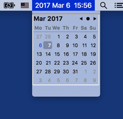

# MenuMeters

Additional features over standart fork:

* Short titles for MEM and CPU metters
* CPU Graph History
* Temperature monitors
* Fan speed monitor
* Date Time widget

# itsycal

MenuMeters clock widget removed in favor of: https://github.com/sfsam/itsycal

# Screenshots

Screenshot CPU Graph | Screenshot Date
--- | ---
 | 

# Installation

Manual installation requires to run:

    sudo xattr -dr com.apple.quarantine ~/Library/PreferencePanes/MenuMeters.prefPane/

# Alernate branches

CPU / Memory per process load monitor not possible to acomplish due to Apple restrictions.

* https://github.com/axet/MenuMeters/compare/master...axet:task_for_pid

# History

### 2002-2014

Original MenuMeters come from:

  * http://www.ragingmenace.com/software/menumeters/

Stopped developed because Apple start put a spokes in wheel, which makes Alex Harper mad and he stops developing MenuMeters.

###  2015-2016

Later, MenuMeters was ported to El Capitan by Tachikawa:

  *  http://member.ipmu.jp/yuji.tachikawa/MenuMetersElCapitan/
  *  https://github.com/yujitach/MenuMeters

### 2016

And then forked by me, to add more nifty features.